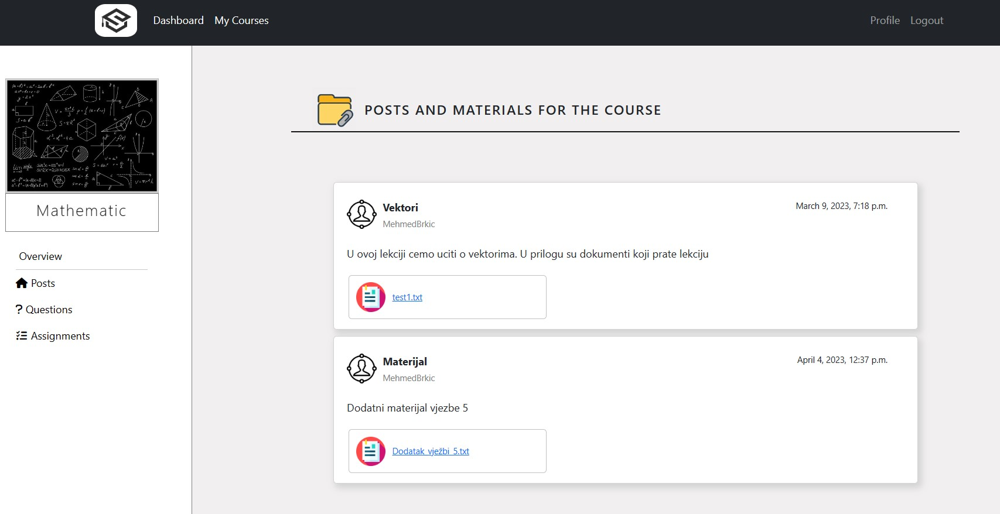
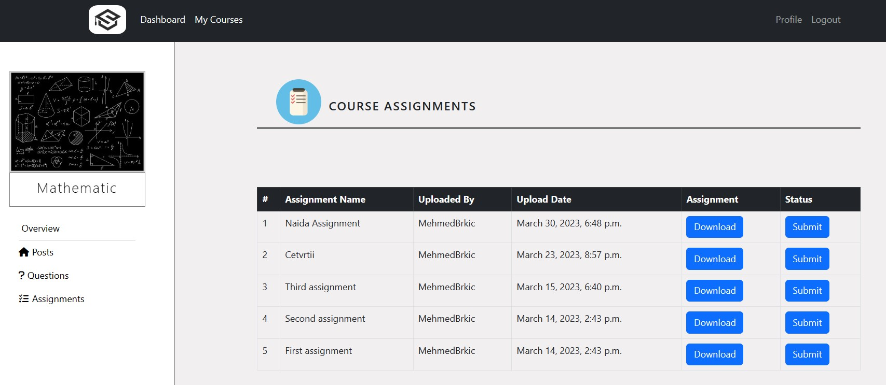
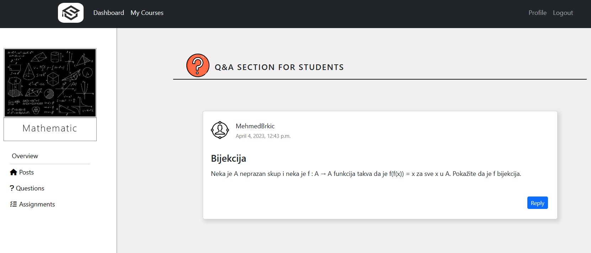
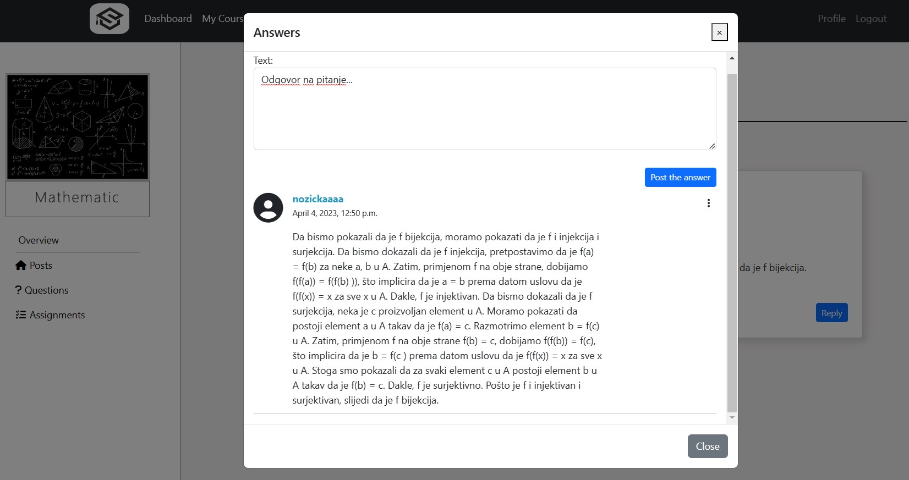
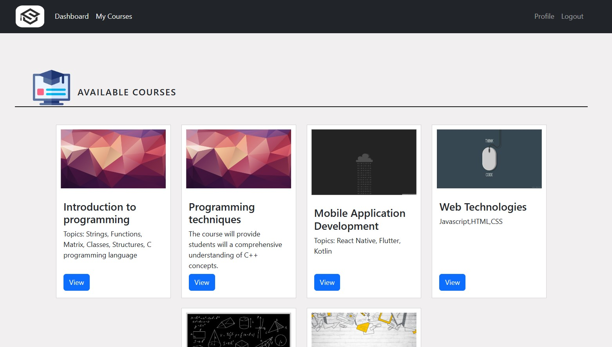
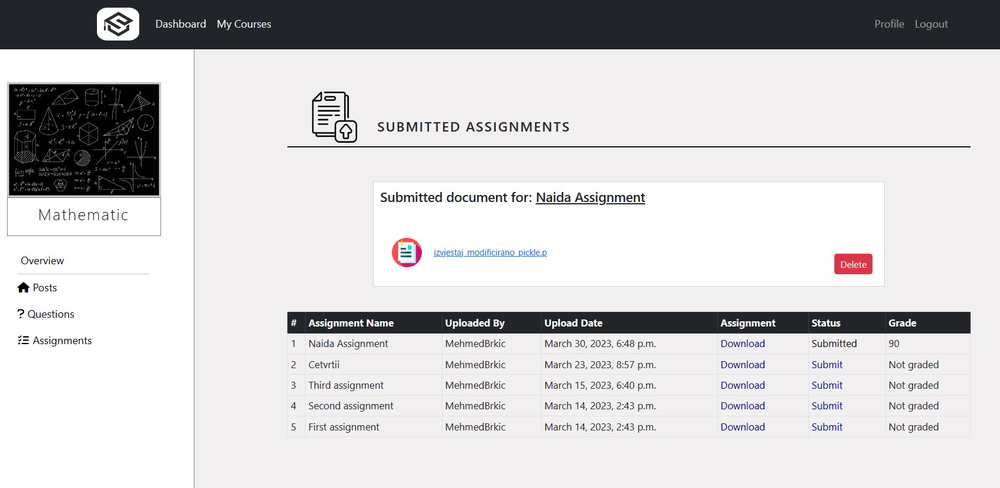
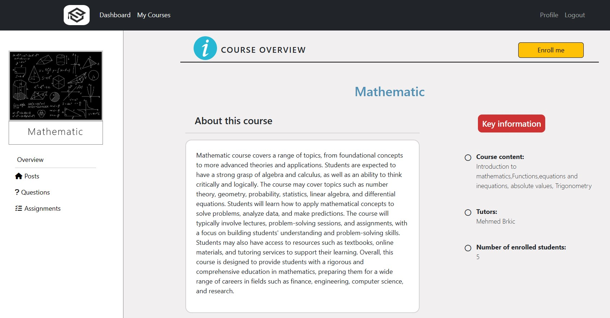
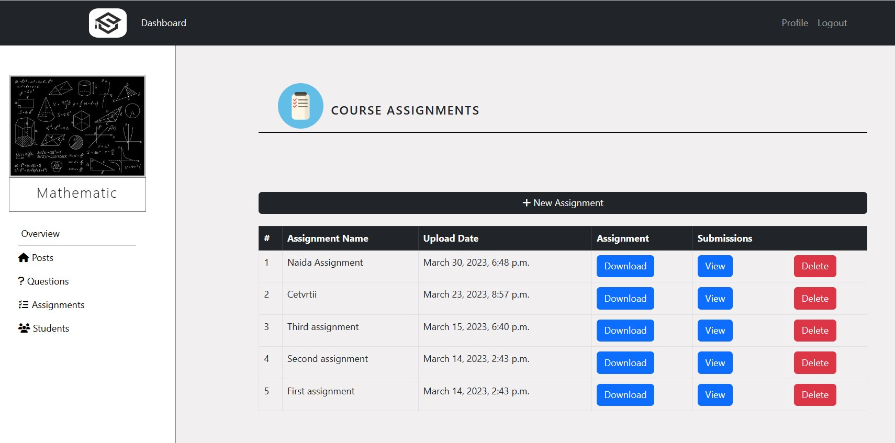
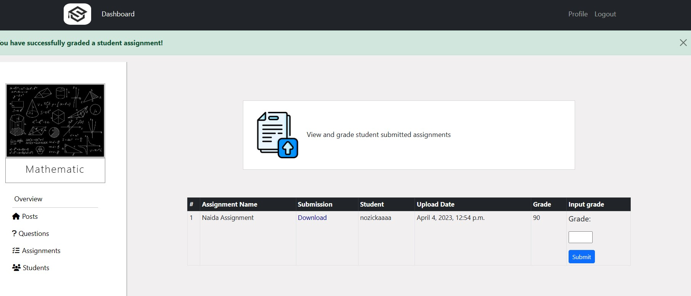

# AcademicAce - Student&Tutor Hub

The web application is an online hub for students and tutors to exchange materials and 
information related to lectures of a particular course.

The project was made using HTML, CSS, Bootstrap, Python, Django framework

<b>Supported functionalities:</b>

STUDENT

<ol>
<li>Enroll to courses</li>
<li>Withdraw from courses</li>
<li>View course materials, posts, assignments</li>
<li>Submit finished assignments and view grades</li>
<li>Ask and answer questions in the Q&A section</li>
<li>View and edit user profile</li>
<li>Login/Registration</li>
</ol>

TUTOR

<ol>
<li>Post materials and course content</li>
<li>Upload assignments</li>
<li>Grade student submitted assignments</li>
<li>Post questions and answers in Q&A section</li>
<li>View and edit profile</li>
<li>Login</li>
<li>Remove students from courses</li>
</ol>

<h3>Images</h3>

<h4>Student: View posts</h4>

<h4>Student: View posts</h4>

<h4>Student: View Q&A section</h4>

<h4>Student: View posts</h4>

<h4>Student: View available courses</h4>

<h4>Student: View submissions</h4>

<h4>Student: View course details</h4>

<h4>Tutor: View and create assignments</h4>

<h4>Student: Grade assignments</h4>

Interfaces for the rest of the tutor functionalities are similar to the student design.

